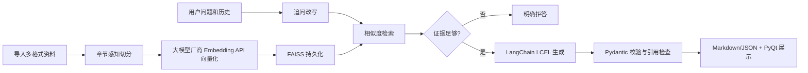

# 课程资料问答智能体

这是任务二“课程资料问答智能体”的完整实现。项目以 Python、LangChain、FAISS 和 PyQt5 构建，支持多份课程资料联合问答，并完成任务书中的全部加分项。

## 功能完成情况

| 要求 | 实现 |
|---|---|
| Python + LangChain | 使用 LangChain 1.2 的 LCEL、Prompt、Tool、消息历史和模型组件 |
| 线上大模型 API | 通过 `ChatOpenAI` 连接 OpenAI-compatible API |
| 至少两个工具 | 提供资料加载、内容检索、章节提纲、练习题、结果保存 5 个工具 |
| 多轮对话 | SQLite 保存每个会话历史，并将追问改写成独立检索问题 |
| 结构化输出 | Pydantic 校验，支持 Markdown 与 JSON |
| 多份资料 | 批量导入、文件哈希去重、删除、重建和持久化索引 |
| 章节复习提纲 | 独立页签按资料/章节生成提纲和检查清单 |
| 练习题与答案 | 支持题量、难度、题型设置，包含答案、解析和引用 |
| 相似片段展示 | 右侧按相关度显示文件名、页码/章节和原文 |
| 防止编造 | 相关度低于默认阈值 0.45 时固定拒答，不调用模型自由补全 |

## 项目结构

```text
agent_project/
├── app.py              # 程序入口与截图模式
├── agent.py            # LangChain LCEL 对话与生成链
├── tools.py            # 5 个 LangChain 工具
├── prompts.py          # 问答、改写、提纲、习题提示词
├── rag.py              # 文件解析、切分、FAISS 检索
├── models.py           # Pydantic 输出结构
├── config.py           # 环境变量与路径配置
├── ui.py               # PyQt5 桌面界面与 QThread
├── verify_e2e.py       # 真实 API 全链路验收脚本
├── package_submission.py # 排除密钥和缓存的提交打包脚本
├── data/               # 示例课程资料和运行时知识库
├── outputs/            # 最终结果样例
├── tests/              # 自动测试
├── screenshots/        # 运行截图
└── requirements.txt
```

## 环境配置

### 创建 Conda 虚拟环境

```powershell
# 创建名为 RAG 的虚拟环境，指定 Python 3.12
conda create -n RAG python=3.12 -y

# 激活环境
conda activate RAG

# 安装项目依赖
python -m pip install -r requirements.txt
```

复制配置模板：

```powershell
Copy-Item .env.example .env
```

在 `.env` 中填写自己的 API Key：

```dotenv
# 大模型对话 API
OPENAI_BASE_URL=https://api_2604_w5t3.zlth.cn/v1
OPENAI_API_KEY=请填写实际密钥
OPENAI_MODEL=qwen3.6-35b-a3b
OPENAI_ENABLE_THINKING=false
OPENAI_MAX_TOKENS=3000
OPENAI_VERIFY_SSL=true

# Embedding 向量化 API（若不单独配置则复用上方 OPENAI_API_KEY）
EMBEDDING_MODEL=embedding-3
EMBEDDING_BASE_URL=https://open.bigmodel.cn/api/paas/v4/embeddings
EMBEDDING_API_KEY=请填写实际密钥
```

## 运行方式

先激活指定环境，再在项目目录执行：

```powershell
conda activate RAG
python app.py
```

1. 点击左侧“导入课程资料”，可同时选择 TXT、Markdown、PDF、DOCX。
2. 在“资料问答”中连续提问；右侧查看检索依据。
3. 在“章节提纲”中填写章节名称生成复习资料。
4. 在“练习题”中设置题量、难度和题型。
5. 点击导出，将结果保存为 Markdown 或 JSON。

## 核心流程



本项目采用可控的两阶段 RAG：先检索、后生成。相比让模型自行决定是否检索，这种方式更容易保证每个回答都基于课程资料。问答、提纲和练习题由 `RunnableBranch` 分流到对应 LCEL 链。

## 测试样例

导入 `data/Python程序设计课程讲义.md` 与 `data/Python实验指导书.md` 后，可测试：

1. Python 中列表和元组有什么区别？
2. `break` 和 `continue` 分别有什么作用？
3. 文件操作为什么推荐使用 `with open`？
4. 函数没有显式 `return` 时会返回什么？
5. 字典的键有什么要求？
6. 追问：“那怎么添加元素呢？”——系统结合上一轮“列表”改写查询。
7. 资料外问题：“量子纠缠有哪些实验验证？”——应回答“当前资料中未找到相关信息”。
8. 资料外问题：“清朝是哪一年建立的？”——同样应明确拒答。

